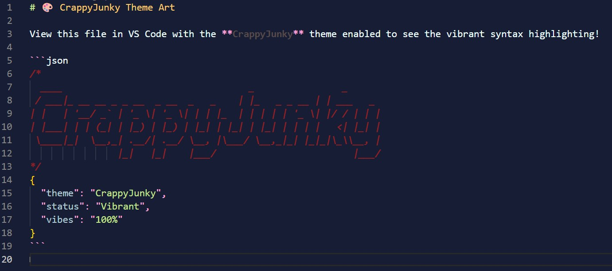

# CrappyJunky VS Code Theme

A dark, vibrant theme designed for those who love high-contrast colors and a personalized coding experience. Featuring deep navy backgrounds with electric cyan, yellow, and magenta accents.

## 🖼️ Preview



## ✨ Features

- **High Contrast:** Easy on the eyes with clear distinction between different code elements.
- **Vibrant Palette:** Uses a unique mix of colors like `#00ffff` (Cyan), `#f2ff00` (Yellow), and `#ffa5dc` (Pink).
- **Italicized Comments:** Red-toned italicized comments for better readability.
- **Specific Language Support:** Tailored highlighting for JSON, Markdown, and more.

## 🚀 Installation

1. Open **Visual Studio Code**.
2. Go to the **Extensions** view (`Ctrl+Shift+X`).
3. Search for `CrappyJunky` (if published) or install via the `.vsix` package (also known as a `.vix` package).
4. Click **Install**.
5. Go to `File > Preferences > Theme > Color Theme` and select **CrappyJunky**.

## 🛠️ Customization Guide: Create Your Own Theme

Want to tweak this theme or make your own? Here’s how to get started:

### 1. Prerequisites
- Install [Node.js](https://nodejs.org/).
- Install `@vscode/vsce` (Visual Studio Code Extension Manager) globally:
  ```bash
  npm install -g @vscode/vsce
  ```

### 2. Modify the Theme
The core of the theme is located in `themes/CrappyJunky-color-theme.json`.
- **`colors`**: Modify UI elements like background, tabs, and status bar.
- **`tokenColors`**: Change how specific code syntax (keywords, strings, variables) is highlighted using TextMate scopes.

### 3. Test Your Changes
1. Press `F5` in VS Code to open a new "Extension Development Host" window.
2. Select your theme in the new window to see live changes.

### 4. Package for Distribution
To share your theme with others, package it into a `.vsix` (or `.vix`) file:
```bash
vsce package
```
This generates a package that anyone can install manually via the "Install from VSIX..." option in the Extensions view.

## 📦 Project Structure

- `themes/`: Contains the JSON theme definition.
- `pic.jpeg/`: Folder containing the theme preview image (`pic.jpeg`).
- `ART.md`: ASCII art showcase of the theme's colors.
- `package.json`: Extension manifest and metadata.
- `CHANGELOG.md`: History of changes and updates.
- `LICENSE`: MIT License information.
- `.vscode/`: Workspace settings for development.
- `.gitignore` & `.vscodeignore`: Files ignored by Git and when packaging.

## 📄 License
This project is licensed under the MIT License - see the [LICENSE](./LICENSE) file for details.

---
*Made with (^_^) by pandey_kun*
